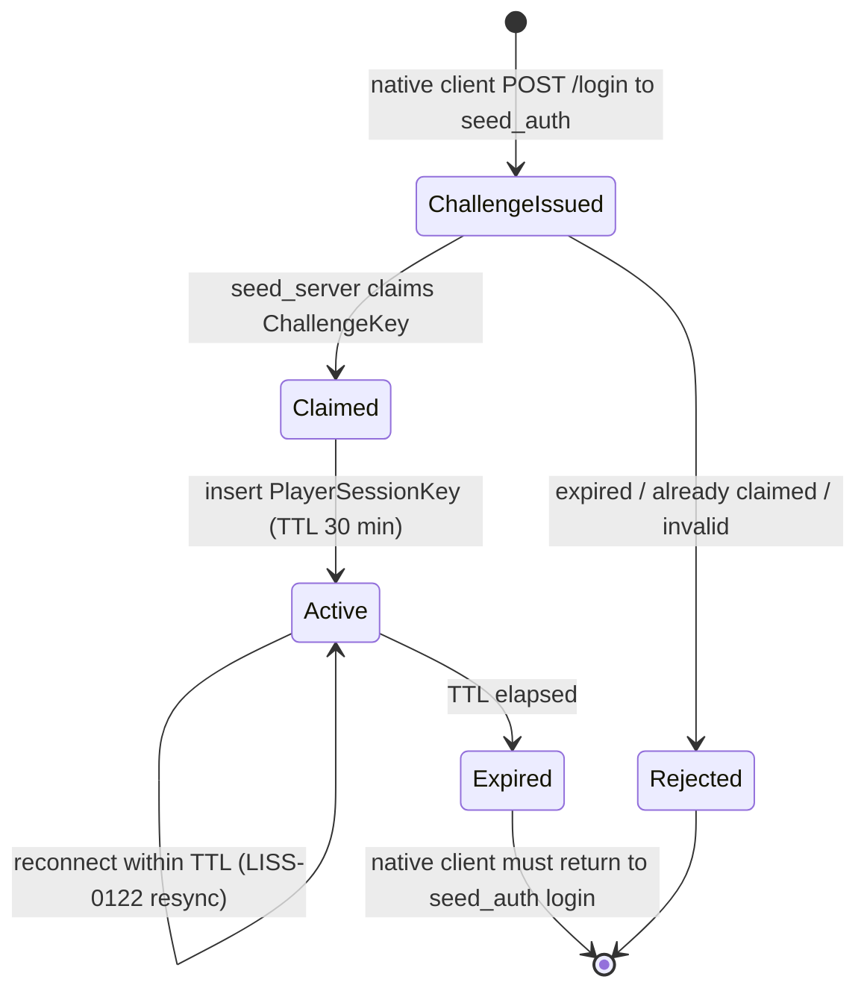

# Player Authentication Flow v1

## Purpose

登録制プレイヤー認証(ADR 0018)の実行フローを、`seed_auth`・`seed_server`・
アカウント管理SPA・ゲームクライアントをまたいで1本のシーケンスとして示す。
ADR 0023で決定した実装言語・二段階キー・ネイティブログイン方式の詳細を反映
する。個々のデータモデル・受入条件はLISS-0146/0147/0148/0149/0150が正とし、
本ドキュメントはそれらを横断するフロー図としての役割を持つ。

本ドキュメントはADR 0023に基づく承認済みの横断仕様であり、
LISS-0146/0147/0148/0149のPhase 1 Red設計・テスト着手の基準とする。

## Actors

| Actor | 実装言語/技術 | インスタンス数 | 資格情報の可視性 |
| --- | --- | --- | --- |
| `seed-auth/frontend`(アカウント管理SPA) | React + Vite | ブラウザ都度 | アカウント管理時のみパスワード可視(入力元) |
| `seed_auth` | Kotlin + Spring Boot(ADR 0023決定1) | 単一(未確定なら単一が既定) | パスワード検証・ハッシュ保存 |
| PostgreSQL(`users`, `player_challenges`, `player_sessions`) | — | 単一クラスタ | `password_hash`のみ保存 |
| ゲームクライアント | Unreal(ADR 0021)/Godot(ADR 0020、いずれも未承認) | プレイヤー都度 | ネイティブログイン入力元、セッションキー保持 |
| `seed_server` | C++ | 複数インスタンス(ADR 0018/0023決定2) | パスワード不可視、`user_id`のみ解決 |

## Flow

```mermaid
sequenceDiagram
    participant P as Player (Browser)
    participant SPA as seed-auth/frontend
    participant Auth as seed_auth (Kotlin/Spring Boot)
    participant DB as PostgreSQL (users, player_challenges, player_sessions)
    participant GC as Game Client (Unreal/Godot)
    participant WS as seed_server (any instance)

    P->>SPA: enter username/password (register)
    SPA->>Auth: POST /register
    Auth->>DB: INSERT users (pgcrypto hash)
    Auth-->>SPA: 201 Created

    GC->>Auth: POST /login (native client form)
    Auth->>DB: verify crypt(); INSERT challenge key (TTL 2 min, single-use)
    Auth-->>GC: challenge key

    GC->>WS: Login Command (payload = ChallengeKey)
    WS->>DB: claim player_challenges where key is valid and unclaimed; insert player_sessions
    DB-->>WS: claim result + user_id (invalid/expired/already claimed = reject)
    WS-->>GC: login result + player session key (TTL 30 min)
    loop client-driven keep-alive
        GC->>WS: keep-alive / session extension
        WS->>DB: extend player_sessions.expires_at
    end

    loop gameplay (normal session)
        GC->>WS: Commands (session-scoped, any seed_server instance)
    end

    alt temporary disconnect with valid player session key
        GC->>WS: reconnect using player session key
        WS->>DB: validate PlayerSessionKey and its expires_at
        WS-->>GC: Snapshot resync (LISS-0122)
    else player session key expired
        GC-->>Auth: native client login form (re-login path)
        Note over GC,Auth: obtain a new challenge key; no browser handoff is used.
    end
```

## Session-key lifecycle



- **ChallengeIssued**: `seed_auth`発行の`ChallengeKey`。未使用、単回限り、TTL 2分。
- **Claimed**: `seed_server`がチャレンジキーを「先勝ち」で消費した瞬間。
- **Active**: `seed_server`がINSERTする`PlayerSessionKey`。TTL 30分、Keep-Aliveで延長。
- **Expired**: 正規キー失効後はネイティブクライアント内で再ログインする。

## Data model (reference — canonical definition remains LISS-0146)

- `users(id, username unique, password_hash)` — `pgcrypto`ハッシュ。
- `player_challenges(challenge_key, user_id, created_at, expires_at, claimed_at)` — Postgres共有、単回利用。
- `player_sessions(session_token, user_id, created_at, expires_at, revoked_at)` — Postgres共有、TTL 30分、Keep-Alive延長、複数`seed_server`インスタンスから参照可能。

## Cross-cutting notes carried from this session (not part of this flow, recorded so they are not lost)

- **NPC/クリーチャーの外部注入**: プレイヤーと同様に外部から注入する方針だが仕組み未定。当面は既存のNPC実装(LISS-0139系)のまま。本フローには影響しない(ADR 0023決定8参照)。
- **プレイヤー進行ドメイン(LISS-0148)**: クラシックな王道MMORPG型とし、独立EXP、
  装備インスタンス、ソケット、スタミナ、`seed_admin`から編集可能なマスターデータ
  を必須とする。

## Resolved requirements

- ゲームプレイログインはネイティブクライアント内で行う。
- チャレンジキーは2分、正規セッションキーは30分。
- 正規セッションキーはKeep-Aliveで延長し、有効なキーによる一時切断のみ
  LISS-0122の再接続Snapshot復旧対象とする。
- LISS-0148はクラシック王道MMORPG型とし、独立EXP、装備インスタンス、
  耐久値・装備EXP・ソケット、スタミナ、管理可能なマスターデータを必須とする。

## Related documents

- `docs/architecture/adr/0018-registered-player-authentication.md`
- `docs/architecture/adr/0019-admin-backend-language-kotlin-spring-boot.md`
- `docs/architecture/adr/0023-player-auth-session-flow-details.md`
- `docs/issues/LISS-0146-user-registration-and-auth-service.md`
- `docs/issues/LISS-0147-world-server-session-token-login.md`
- `docs/issues/LISS-0148-player-progression-persistence-schema.md`
- `docs/issues/LISS-0149-registration-login-react-spa.md`
- `docs/issues/LISS-0150-deprecate-anonymous-login-and-alias-reconciliation.md`
- `docs/issues/LISS-0122-reconnect-snapshot-recovery.md`
- `docs/specs/network-protocol-v1.md` (Login payload meaning change note)
- `docs/work-plans/WP-0009-registered-player-authentication.md`
